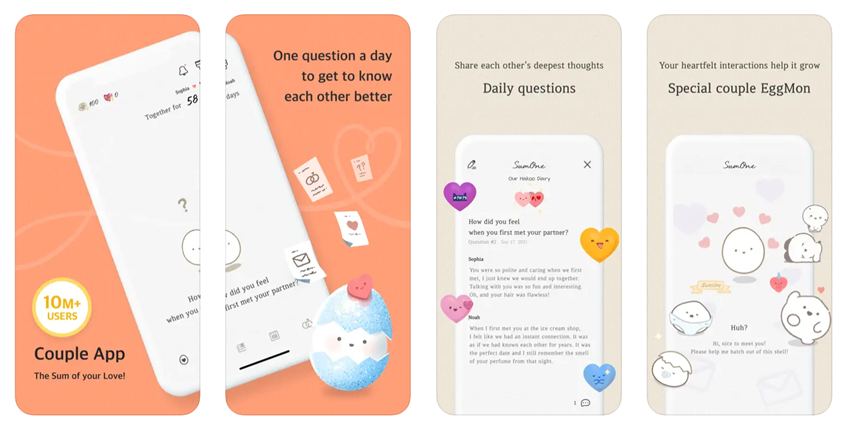
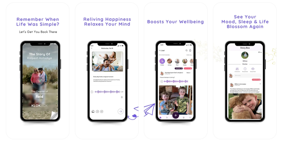
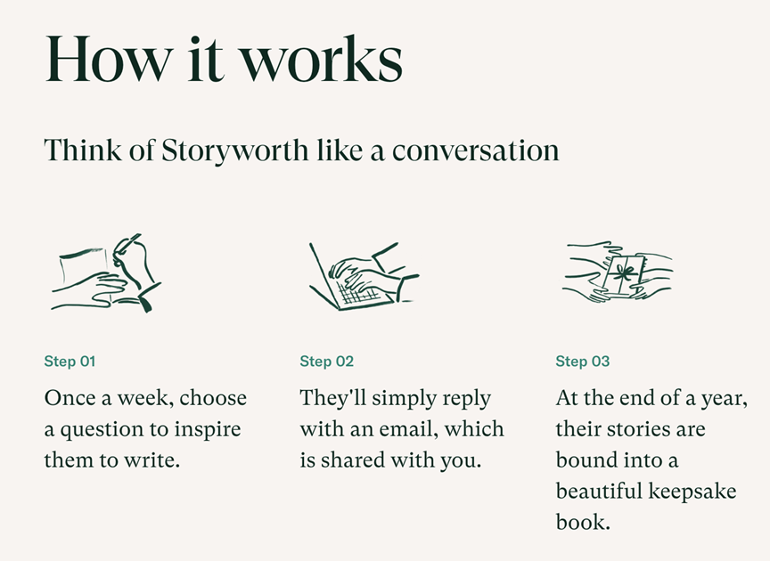
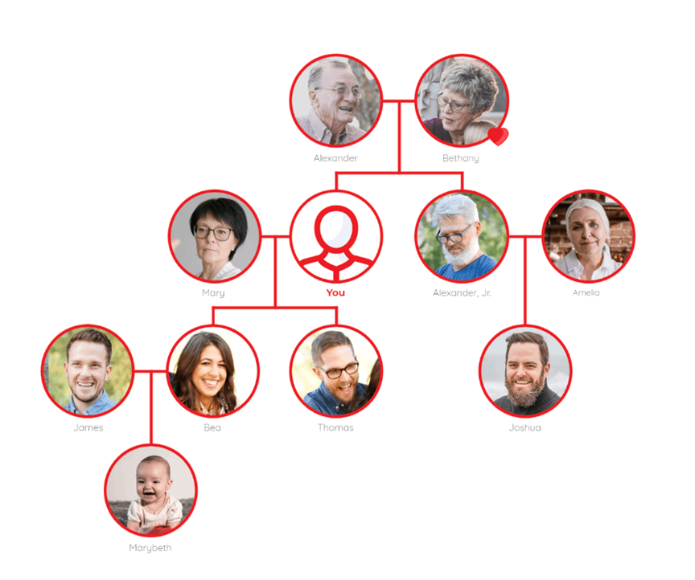
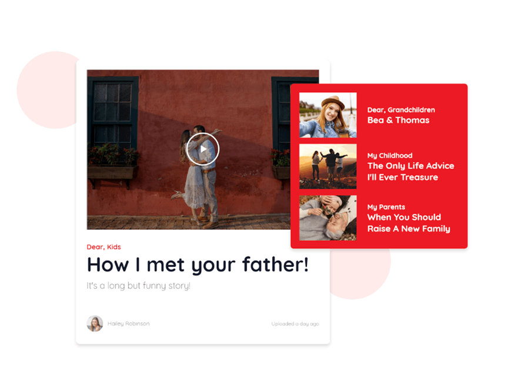
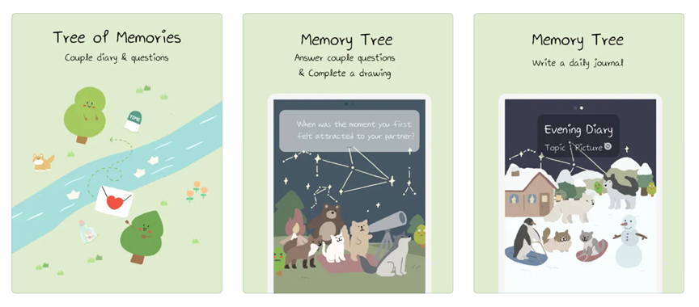

# Project Phase 1: Impact Case

## Team Contract

The following is a team contract for MIT 6.1040. The following are the terms of the team contract:

Our expected level of achievement is to get the best grade possible and be able to create a feasible app we can possibly even use ourselves. We plan to budget whatever time necessary to be able to sustain this with our teammates and will communicate when certain weeks may be tougher so we can balance work together.

### Personal Goals
These are the personal goals of each team member:
- Heather: I want to be able to learn better about the coding aspect of creating an app since I felt like I understood the design aspects well
- Shih-Peng: I would like to focus more on the front-end design and be able to write modular code that is easy to modify. Also I would like to learn how to work with my teammates for a full-stack project.
- Kevin: I would like to focus on constructing backend and efficient data storage. Also I would like to get better at frontend styling.
- Brianna: I would like to focus on backend design and learning how to work collaboratively with other team members on a full stack application.

### Meeting Time
We will plan to meet the same times as regular class section at MIT Campuss, alongside with meetings with TA Dana on Mondays during class time (2:30-3:15PM)
Quality of work will be maintained during check ups at our meeting times, as well as team review meetings via Zoom

### Task Assignment
Tasks will be assigned at the start of the release of each assignment. If deadlines are missed, we will alert our group members if necessary to have it be done as soon as possible. In regards to tasks, unless a team member is having a rough week:
- The amount of work per team member must be roughly the same over the length of the project; and
- Each team member must participate in all stages and in all activities (eg, interviewing, designing, coding, etc).
- Decisions will be made collectively and through effective communication via Zoom or in-person for severe disagreements

## Impact Case

The problem of maintaining meaningful connections with loved ones is important because many people struggle to find the time or emotional capacity for deep conversations due to physical distance, time constraints, or the emotional strain/turmoil from having such conversations. This can lead to feelings of isolation, reduced emotional support, and weakened bonds, especially when there may not be enough time to connect. 

Our solution to address this problem is an app that creates a low-pressure space for loved ones to connect through guided prompts about personal topics. This allows for meaningful connection without requiring physical proximity or intensive time commitments, as it only requires one message at a time.

We believe this app is a good solution because it provides a structured and flexible way for loved ones to share experiences and learn more about each other without the burden of scheduling long conversations. The prompts reduce the barrier to opening up, making it easier to maintain close connections over time, even with busy or distant loved ones, especially when people do not even know when to start.

We could measure the frequency and depth of shared messages, user engagement with prompts, and self-reported feelings of connection to prove that our app helps people maintain and deepen their relationships, even across distance and busy schedules to prove that our app would be a good solution to developing more meaningful connections between people.

## Identify Interviewees

### Potential Stakeholders
- Young Adults: People who have a busy lifestyle with their work or for other reasons so that they do not have enough time to see them
- Long-Distance Family Members: Family members who wish to stay connected but struggle due to time zones or busy schedules
- Elderly: Elderly individuals who may find technology challenging but want to stay in touch with their family members that are not near

### Potential Experts
- Psychologist: an expert who specializes in emotional connection, long-distance relationships, and the impact of reduced face-to-face communication
- Experts in emotional health and well-being: able to understand the impact of long-distance communication tools and supporting mental health
- Expert in UI/UX design: what certain designs are easier, especially in regard to a target audience that may include the elderly, in terms of easy usage but also aesthetics

## Research on Gaps

The following are some applications that are related to our impact case but do not fully meet the application that we have envisioned..
- **SumOne**
> An application to promote communication and intimacy between couples. Every day, a prompt/question ranging from light-hearted to profound one is provided for the couple to answer. As the couple participates more, the virtual pet “EggMon” evolves, representing the growth of the relationship. A new feature includes a calendar view to record special events or dates for couples.

- **Klokbox**
> A digital time capsule where users can add photos, videos, and audio messages to the “story boxes”, which allows users to control who and when sees the content, which enables the elderly to allow their family/descendants to “access one’s memory”.

- **StoryWorth**
> It is a service that guides people through a storytelling process. The person receives a question via email every day about a meaningful experience or family story. After a year, those stories are bound into a hardcover book.

- **Inalife**
> It is a legacy platform for families to create and share memories across generations, where photos, videos and stories can be stored. Those memories are only accessible to a selected family circle. Users can also build their family tree in this application and message their family.

 

- **Memory Tree**
> Tree of Memories is a free app that allows you to plant trees with partners by answering interesting questions and sharing daily diaries.

Hence, the followings are the gap that the current applications do not serve the needs of stakeholders:

- **Guided Prompt**
> StoryWorth has guided prompts for users; yet, it is less interactive and people who want to view those memories can only access it from the physical book, which does not satisfy the need of diminishing the distance. SumOne provides the same prompt for all users on each day, which does not provide much guidance and is customized and is only limited to relationship-related questions.
- **Connection Subjects**
> As mentioned, SumOne only allows information exchange for couples. Inalife only allows for family members. In those existing applications, memory storage applications are often limited to intended use such as couples and families, which are less flexible. Klokbox is relatively flexible, but it serves as a time capsule, which is less interactive and less convenient to obtain information promptly. We are looking for a more flexible way to connect memories to people-people connection.
- **Engaging Environment to Share**
> SumOne passively forces users to answer the questions, or the new question will not update, which might intimate the user if there are some questions that are hard to answer. StoryWorth sends daily email, which is also slightly passive-aggressive to request new stories. Other applications do not give particular motivation for the user to share their stories. Here, we are looking for a prompted-based, feedback system to make sharing more engaging!
- **Relationship Between Memories**
> In the existing apps, despite that the memories are archived and displayed chronologically, those memories does not have relationship necessarily; instead, they could be very different and similar topics can be scattered all around in the application. If we can categorize and extend the tree of the memories, the user would be able to see the topic becomes deeper and meaningful along the "memory tree".

## Explore Impacts
### Stakeholders:
- Non-targeted use
> Due to the app being able to support long-distance communication and conversational messages, the app has the potential of unintentionally becoming a regular messaging app where users outside the US communicate in normal conversation with users in the US rather than doing the prompts. This could potentially dilute the purpose of the app, which is to facilitate deep conversations, between loved ones.

- Variation in human ability
> Our app heavily relies on sight in order to read the prompts and participate in the online messaging. For users who are sight-impaired, it may be hard for them to use the app and potentially exclude them from using the app.

### Time:
- Sustained Friendships
> Our app may negatively influence how users make and sustain friendships with their loved ones due to its emphasis on consistency. Users may be consistent in engaging in “deep” conversations with their loved ones, but these conversations may turn to be one-sided, obligatory, surface level, etc. if the user is just engaging in the conversations to maintain a streak.

- Choosing not to use
> Elderly or non-technologically savvy loved ones may choose not to use the app due to them thinking that they won’t know how to use the technology to communicate with other loved ones, even if they wanted to. These potential users could be excluded from the community formed by our app and wouldn’t be able to enjoy the benefits of using the app to engage in deep conversations with their loved ones consistently.

### Pervasiveness:
- Crossing National Boundaries
> Our app may experience deployment challenges in some countries due to privacy laws and censorship in some countries. Some of the content on the app may be historical content from the lens of individuals (i.e. a older user telling their younger loved one about life in their country), which depending on the content and the information it discloses about people or the country, could be subject to censorship or further processing in order to comply with the country that the app is trying to be deployed to. This interferes with the authenticity of the app’s content and could add complexity on how we think about accommodating users that are using the app in different countries.

### Values:
- Value Tension
> Our app supports the value of facilitating community through guided prompts but also protects the privacy of users since they are sharing personal stories. These two values of facilitating community through online conversations and protecting the privacy of users conflict. This could lead to the unintended consequence of identifying information about users or people involved with the user being revealed through conversations or stories being revealed that were not meant to be revealed.

- User Experience of Values
> Even though we as designers believe that our app is facilitating relationships and community among loved ones, users who use the app may feel that it distances them from their loved ones due to the virtual aspect of the conversations. Users may feel that the ability to converse with their loved ones about deep topics online deters users from establishing community and relationship building outside of the app face-to-face with their loved ones.

- Environmental Sustainability
> When the app grows in popularity and amasses many users, the amount of data that needs to be stored (i.e. the conversations, user information, etc.) will be stored in data centers. This contributes to negative environmental effects caused by data centers such as water consumption, noise pollution, energy consumption, and more.

## Conduct Interviews

### Interview Questions
**Introduction** 
- Thank you for taking the time to speak with us today! We’re interested in understanding how people maintain meaningful connections with their loved ones, especially when distance or busy schedules make it difficult to stay in touch.
- Our goal is to learn more about the ways people connect with family and friends across distance, the challenges they face, and any tools or strategies they find helpful or would be interested in exploring. This will help us design a solution that could make it easier to stay connected in meaningful ways.
- Warm-Up Question: To start, could you tell us a little bit about yourself and your family background, or the people you most often keep in touch with?

**Connection and Communication Habits**
- Could you describe your current role and relationship dynamics within your family or friend group?
- How do you typically keep in touch with family members who are far away? (E.g., calls, text, video chat, social media)
- What does a typical conversation with them look like? Are they mostly short check-ins, deeper conversations, or something else?
- How frequently do you reach out or communicate with family members, such as parents, siblings, or extended family?
- Do you feel there are any challenges in staying in touch? If so, could you share what these challenges are?
- How often do you wish you could have a meaningful conversation or spend more time connecting deeply?
- How would you describe the ideal balance between staying connected and managing your daily responsibilities?

**Emotional Connection**
- Do you feel you are able to share what’s going on in your life with your loved ones? Why or why not?
- Have you ever wished for a more meaningful way to connect with your family, despite distance or time constraints?
- What aspects of your relationship would you like to strengthen or understand better?
- Are there any types of topics you avoid in conversation but wish you could talk about more openly?

**Digital Communication and Technology**
- What are your current go-to tools for staying in touch with family? What do you like or dislike about them?
- Have you ever used an app or digital tool to have guided conversations? What was your experience like?
- How comfortable are you with using new apps, and what are your preferences for interface or accessibility?
- How much time would you be willing to commit to an app that helps you stay in touch with family members?

**Interest in Connection Aids**
- Do you think guided prompts for conversations would help you communicate more deeply with loved ones? Why or why not?
- If you could receive conversation prompts that are meaningful and relevant to your relationships, how would you feel about that?
- Are there any specific topics or areas of life you’d love to learn more about from your loved ones?

**Keeping Memories and Connection Over Time**
- Do you currently keep any kind of family archive, like a photo album, writing, or video recordings? How often do you revisit these?
- How would you feel about being able to look back on past conversations with family members?
- What kinds of shared memories or interactions feel most meaningful to you?

**Closing**
- If you could change one thing about how you currently connect with family, what would it be?
- In your experience, what’s been the most valuable way to stay connected to loved ones over distance or time?

### Interview Key takeaways 
[Original Response](https://drive.google.com/drive/folders/1O4uo39bdNR7uJq69SYYCbs7nTzh6ZCGy?usp=sharing)

#### Dani (20, Cuban Immigrant): 
Dani primarily communicates with family in Cuba and the U.S. through group chats and sporadic messages but feels distanced from her Cuban relatives due to language barriers and limited resources. She’s curious about her cultural heritage and would value a way to bridge this gap with meaningful conversations. While she finds apps like WhatsApp useful, she’s skeptical about prompts driving engagement without deeper conversations. An interactive memory archive and culturally relevant prompts could foster her desired connection.

#### Skyler (20, College Student who studied Psychology, now studying Inclusive Childhood Education): 
Skylar connects with her small, close-knit family primarily through phone calls, finding real-time voice conversations more meaningful than texts. She’s interested in exploring family history and sensitive topics like trauma but struggles to connect frequently due to conflicting schedules. She appreciates structured prompts that build trust and values physical memories over digital. A solution could include real-time voice features, gradual prompts for deeper topics, and a simple, accessible design.

#### Kevin’s Grandpa (85, WeChat User): 
Kevin’s Grandpa values purposeful communication and keeps social interaction minimal, preferring tangible mementos like printed photos of his grandchildren. He enjoys occasional updates that maintain novelty but dislikes group chats and frequent socializing. A solution for him should focus on low-commitment, purposeful notifications, support for physical keepsakes, and a simple, private interface with minimal disruptions.

#### Wan-Ching (45, Housewife in Taiwan): 
Wan-Ching prefers passive engagement, visiting nearby family regularly but rarely initiating digital contact. She enjoys observing social media updates and low-pressure interactions like “boomer graphics” as a gentle reminder of others’ presence. She values revisiting memories, especially family gatherings, and is open to an app with guided prompts if it allows her to control engagement. A solution should offer subtle updates, memory prompts, and options for physical keepsakes.

## Revised Impact Case

The problem of maintaining meaningful, generational family connections is important because within the framework of the ecological theory, our family microsystem—parents, grandparents, siblings—play an important role in shaping our culture, values, and personal identity. However, physical distance, busy schedules, and sometimes emotional sensitivities when trying to start conversations make it difficult to engage in these conversations, resulting in lost memories and missed opportunities for connection.

Our solution to address this problem is an app that creates a shared memory space for family members to contribute to over time. It provides both personalized and structured prompts to guide insightful conversations, with additional “deeper” questions as conversations and greater memories are shared, which allow family members to annotate and share photos, and lets users gradually discover stories from their relatives, creating a sense of connection even across distance. The app’s low-commitment prompts encourage quick yet consistent use, while shared “memory threads” enable multi-user contributions to a single memory.

We believe this is a good solution because it combines casual, low-pressure prompts that can align with people’s busy schedules with intentional archiving, allowing family members to share stories and insights at their own pace. By progressively deepening prompts and having the inclusion of AI support when creating follow-up questions for initial personalized pr5ompts, the app can guide family members into meaningful discussions. Features like skippable and personalized prompts, archiving/unarchiving past prompts to be able to go back and forth from past memories, annotations for photos to be able to explain photos better, and an easy-to-view archive differs from other apps in that the content can be memory specific for each prompt and allows flexibility in its prompts compared to other “memory-sharing” apps.

We could measure engagement rates (which includes both frequency of using the app and prompt completion), the diversity of contributions within shared “memories” of a variety of users of different groups (age, occupation, nationality), and user-reported feelings of how connected or close they now feel to their relative to prove that our app effectively deepens family connections and helps users uncover past history and information about their family members that contribute to a stronger sense of their own identity and values.

## [Class Pitch](https://docs.google.com/presentation/d/13Zgty1mDp-KWTWPOdfJkaE-cLYcBzMCfyNeDU07e65I/edit?usp=sharing)

